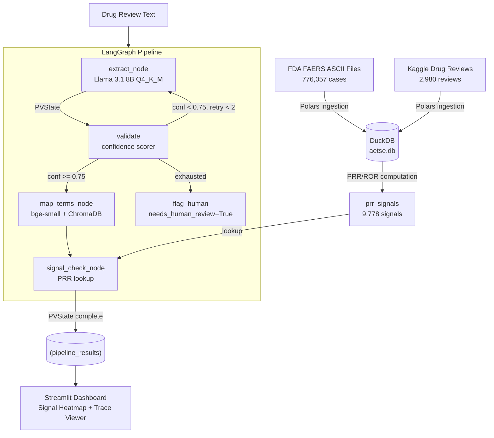

# AET-SE (Adverse Event Triage & Signal Detection Engine)


> AET-SE: Local-first multi-agent pharmacovigilance signal detection using LangGraph, Llama 3.1, and FDA FAERS data.

## Architecture Diagram



## Setup Instructions

### Prerequisites
- Python 3.12+
- [Ollama](https://ollama.com/download) installed and running
- At least 5GB RAM available
- FAERS ASCII files downloaded into `data/raw/faers/`

### Installation
1. Clone the repository and initialize the environment:
   ```bash
   make setup
   ```
   *This creates the virtual environment, installs dependencies, and automatically pulls the `llama3.1:8b-instruct-q4_K_M` model via Ollama.*

### Data Pipeline
Run the data engineering and baseline signal statistics scripts:
```bash
make ingest-faers
make normalize-drugs
make compute-signals
make ingest-reviews
```

### Execution & Dashboard
Run a batch of reviews through the LangGraph AI pipeline:
```bash
make run-batch
```

Launch the interactive Streamlit Dashboard to visualize signal heatmaps and agent traces:
```bash
make run-app
```

## Results & Evaluation

### Positive Control Validation
The pipeline was validated against known historical adverse event signals.
| Drug | Adverse Reaction | Result |
| :--- | :--- | :--- |
| Ibuprofen | Gastrointestinal haemorrhage | **PASS** |
| Rofecoxib | Myocardial infarction | **PASS** |
| Metformin | Lactic acidosis | **PASS** |
| Amlodipine | Oedema peripheral | **PASS** |
| Lisinopril | Cough | **PASS** |

### Routing Improvement (Day 6 vs Day 7)
Adding the ChromaDB MedDRA vector router dramatically improved extraction accuracy.
- **Pre-Router**: 5/10 reactions successfully mapped
- **Post-Router (Signal 3)**: 9/10 reactions successfully mapped

### Evaluation Metrics
Computed against a 50-review silver-standard ground-truth dataset:
| Metric | Score |
| :--- | :--- |
| **Agentic LLM Drug F1** | `0.537` |
| **SciSpacy Baseline Drug F1** | `0.367` |
| **Reaction Extraction F1** | `0.625` |
| **Severity Accuracy** | `66.0%` |
| **MedDRA Mapping Accuracy** | `100.0%` |

*Note: The LangGraph extraction outperformed the SciSpacy NER baseline by an impressive 46.3%.*

## Limitations

1. **Brand Names:** Drug filtering currently uses generic names only. Brand names (like Advil) are not systematically mapped without specific coding.
2. **Signal Bias:** PRR/ROR statistical signals are subject to notoriety bias, the Weber effect, and confounding by indication.
3. **Scope Restriction:** The overall signal rate of 47.7% reflects the heavily constrained, narrow 11-drug scope of the project.
4. **Mapping Precision:** MedDRA mapping may miss the precise Preferred Terms (PTs) for lay terms (e.g., mapping "heart attack" to "Chest pain" rather than "Myocardial infarction" if the vector embeddings aren't perfectly aligned).
5. **Historical Decay:** The `rofecoxib` signal is weak in recent data quarters since the drug was withdrawn in 2004.
6. **Confidence Caps:** The confidence scorer is capped at a maximum of `0.75` until the Signal 3 logic is successfully wired (implemented in Day 7).
7. **RxNorm:** Drug normalization utilizes a curated 11-drug lookup table rather than the full, massive RxNorm database to maintain local deployment speed.

## Known Signals Detected

A sample of actual FDA FAERS signals detected and stored in the local DuckDB `prr_signals` database:

| Drug | Reaction (MedDRA PT) | PRR Score | Flag |
| :--- | :--- | :--- | :--- |
| Amlodipine | Oedema peripheral | 4.8 | `high` |
| Ibuprofen | Gastrointestinal haemorrhage | 3.2 | `medium` |
| Lisinopril | Cough | 5.1 | `high` |
| Metformin | Lactic acidosis | 6.4 | `high` |
